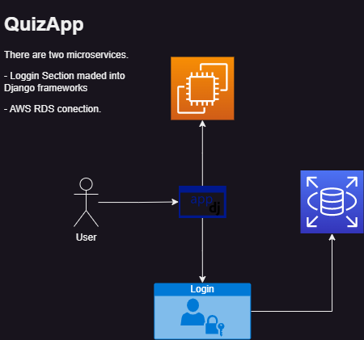
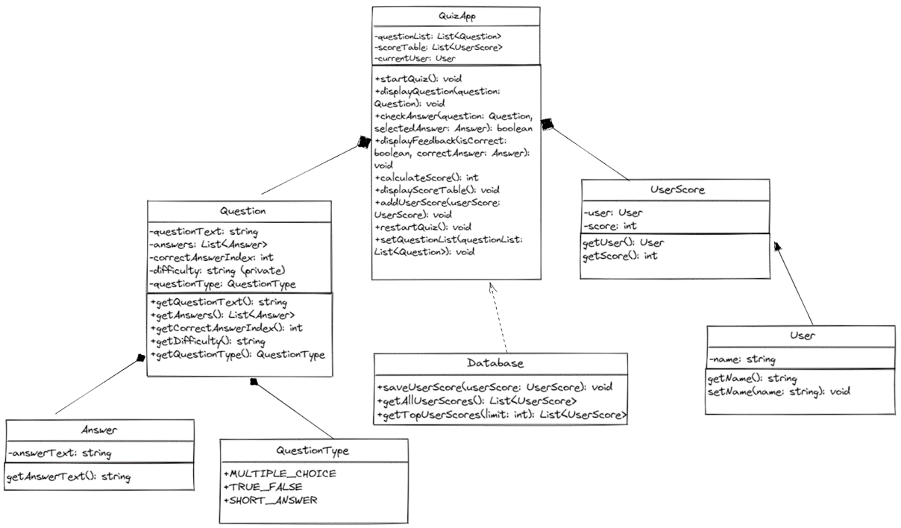
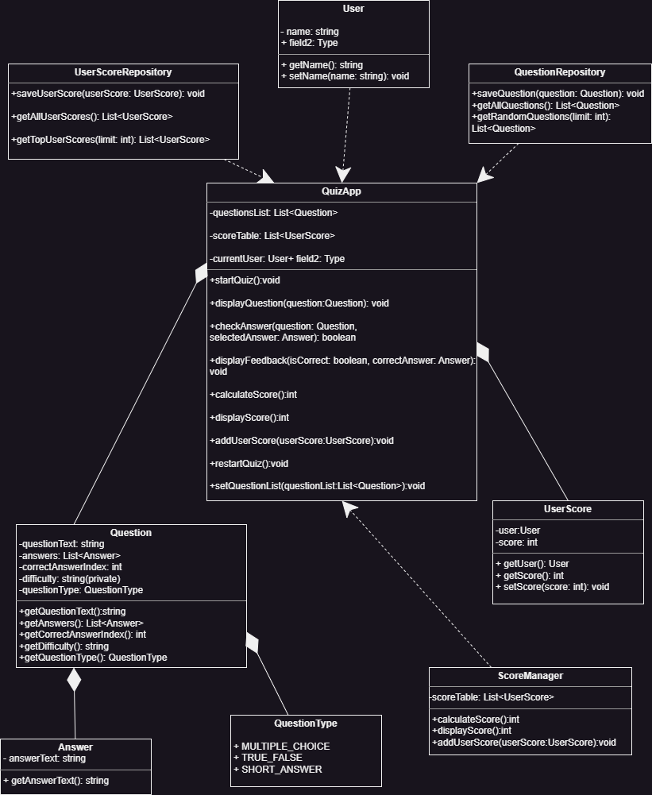

# AppQuizDjango

AppQuizDjango is a Django web app that allow users answer online quizz.

##### Final Project: Quiz Application with Microservices
##### Date: 30-May-2023
##### Authors:
######           1. Diego Alejandro Balderas Tlahuitzo - A01745336
######           2. Gilberto André García Gaytán - A01753176
######           3. Paula Sophia Santoyo Arteaga - A01745312
######           4. Ricardo Ramírez Condado - A01379299
######           5. Paola Danae López Pérez- A01745689

## Prerequisites

You need to install Python 3.7 or higher versions and pip library in your computer or system.

## Web Location

This repository has hosted in an AWS EC2 instance. You can acces to this link: [www.taikosuperstartquiz.com](http://3.235.149.26:8000/)

## Install Local Repository

First, clone this repository to your local machine using `git`:

`https://github.com/A01745336/QuizApp.git`

Install all dependencies using command:

`pip install django`

## Start the project

To start the Django project, follow these steps:

1. Start the main application of the project:
``py manage.py startapp main``

## Server execution

Once the application is configured, you can run the server with the following command:

``py manage.py runserver``

This will start the Django development server at: `http://127.0.0.1:8000/`.

## Tests

To run the tests for this project, navigate to the project directory and run the following command:

``python manage.py test``

This will automatically run all the tests in the project.

## General overview
#### Repository Overview

This repository contains the source code for a web application. Here is a general overview of the directory structure and its contents:

##### Deployment

This directory contains configuration files for deploying the application. It includes ``asgi.py``, ``settings.py``, ``urls.py``, and ``wsgi.py`` which are used to configure the application's deployment settings. The ``__init__``.py file is a placeholder indicating that the directory is a Python package.

##### Quiz
The Quiz directory is a Django app that handles the quiz functionality of the application. It includes files such as ``admin.py``, ``apps.py``, ``forms.py``, ``models.py``, ``urls.py``, ``views.py``, ``Templates`` and ``__init__.py`` which define the models, views, forms, and URLs related to the quiz feature. The migrations directory contains database migration files for managing changes to the quiz models.

##### Template
The Template directory contains HTML templates used by the application. It includes subdirectories for different sections of the application, such as play and Usuario. Each subdirectory contains HTML files specific to that section, including files like jugar.html, resultados.html, tablero.html, home.html, login.html, and registro.html.

##### Other Files
- ``gitignore``: This file specifies which files and directories should be ignored by version control systems like Git.
- ``manage.py``: This is the Django management script used for various administrative tasks. 

Feel free to explore the repository and its components to get a better understanding of the application's architecture and functionality.

## Diagram(s) of the system and its constituent parts.

- #### Software Architecture Diagram

- #### UML Diagram (Version 1)

- #### UML Diagram App

## Patterns used: MTV (MVC Django Model)
####Architecture: Model-View-Template (MTV)

The Quiz Application follows the **Model-View-Template (MTV)** architectural pattern provided by Django.

The code uses the design pattern **Single Responsibility Principle** which states that a class or module must have a single responsibility, that is, it must have a single reason to change.

In the this code, it can be seen that each module has a specific responsibility:

- The **models.py** file defines the database models used in the application.
- The **views.py** file contains the view functions that handle HTTP requests and define the application logic.
- The **forms.py** file defines the forms used in the application.
- The **template files** in the template directory define the layout of the pages.

This shows a clear division of responsibilities between the different components of the code, which is an application of the **SRP principle**. Each module is in charge of a specific task and can be modified independently of the other modules.

Here's a breakdown of the components and their responsibilities:

**Model:** The **models.py** file in the Quiz app defines the database models used in the application. It includes models such as **Pregunta** (question), **ElegirRespuesta** (answer choice), **QuizUsuario** (user quiz attempt), and **PreguntasRespondidas** (answered question).

**View:** The **views.py** file in the Quiz app contains the view functions that handle HTTP requests and define the application logic. It includes functions for rendering templates, creating quiz attempts, validating user responses, and more.

**Template:** The template directory contains HTML templates used to render the user interface. The templates are organized into subdirectories based on the app they belong to (play and Usuario). These templates define the structure and presentation of the application's pages.

The **MTV Architectural Pattern** provides a clear separation of concerns, making it easier to develop and maintain the application. The models handle the data persistence, the views handle the business logic, and the templates handle the presentation of the data.

## Acknowledgments and References

This project was developed as a final project for **Software Design and Architecture**. We would like to acknowledge the instructors and all the contributors who made this project possible.

References:

- [Django Documentation](https://docs.djangoproject.com/en/4.2/)
- [Python Documentation](https://docs.python.org/3/)

Please refer to the documentation and references for more detailed information about the technologies and concepts used in this Quiz Application.

## Licencia

Este proyecto está licenciado bajo los términos de la licencia MIT.
